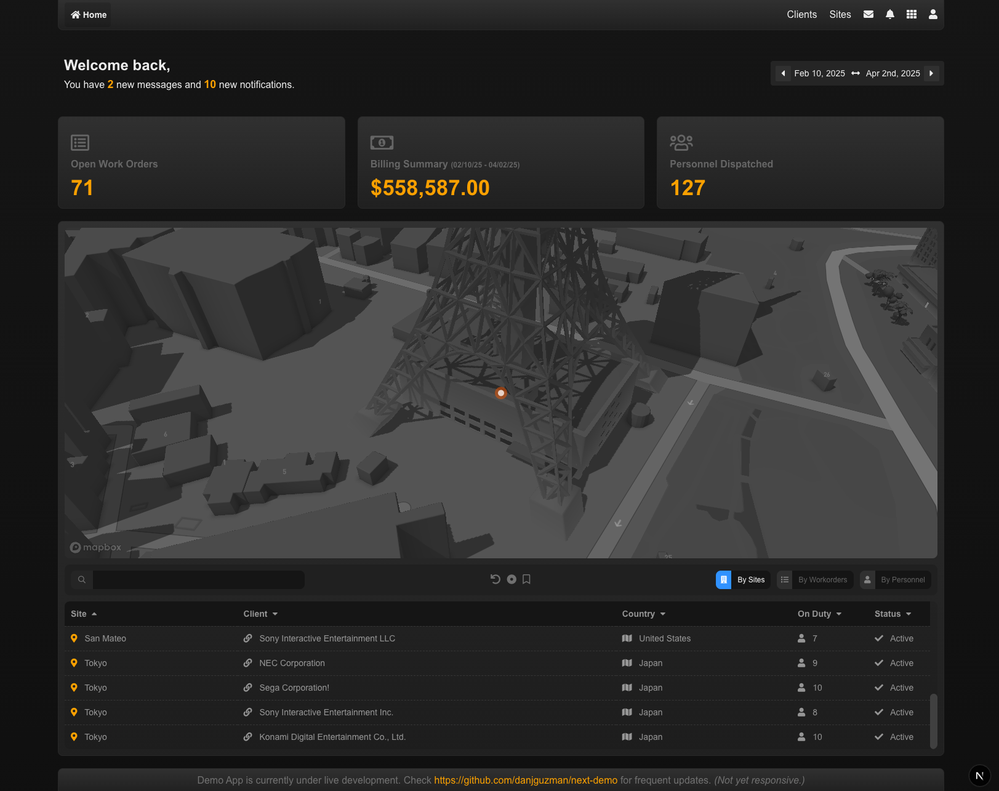
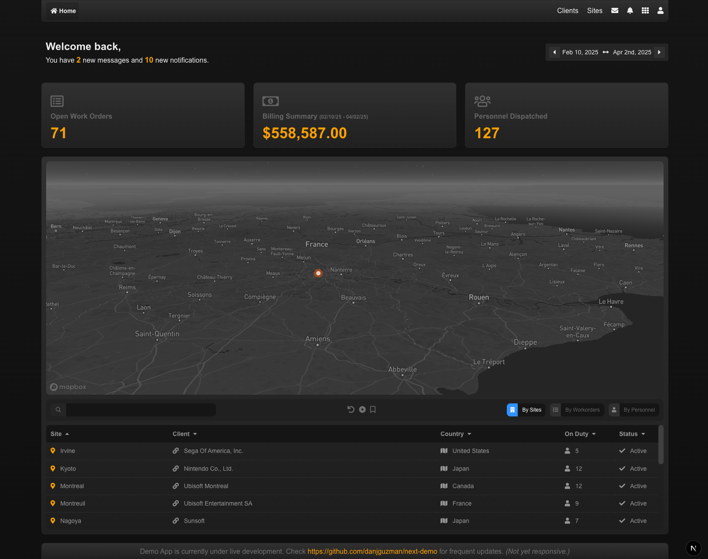
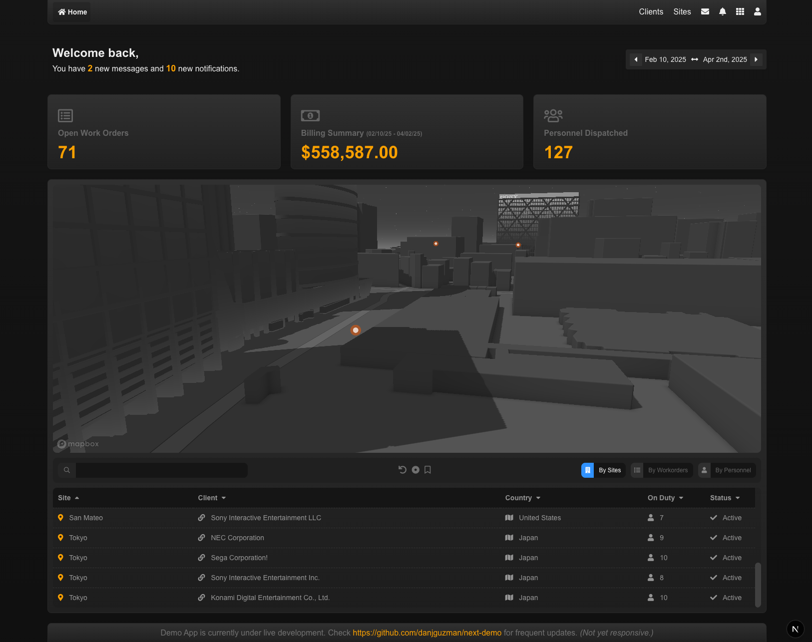

## About Daniel Guzman (available for hire)

I am a Senior Front End Developer with over 10 years of experience building scalable, interactive web apps using React, Next.js, and TypeScript. I love crafting fast, user-friendly UIs with smooth CSS animations, transitions, and micro-interactions—like subtle hovers or snappy toggles—that bring designs to life. I’ve worked remotely with designers to turn complex ideas into pixel-perfect, performant interfaces, always chasing that sweet spot between clean code and a great user experience. I’m hooked on tough challenges and constantly leveling up my front-end skills.

If interested, find me on LinkedIn: <a href="https://www.linkedin.com/in/danjguzman" target="_blank">https://www.linkedin.com/in/danjguzman</a>

## About The Current Project

Preview video focused on creating a smooth Mapbox experience: https://youtu.be/FG-YPWj59u0

This is a mock-up of a Workforce Management platform—though it’s flexible enough to work for any industry—built as a demo project with React and Next.js to showcase my front-end coding skills. It focuses on crafting reusable components, managing data with a state manager like Redux Toolkit, and wrangling data from multiple sources—fetching, parsing, and blending it into clean, UI-ready states.

The project is fully open and you’re welcome to follow along as I turn ideas into solid, working software. It’s still actively in development, so you might notice a few issues here and there until I get them sorted out.

## What’s Inside

This demo includes some core features you’d typically find in platforms similar to this:

- A dynamically generated table with sorting, making it easy to organize and explore data.
- A Mapbox-powered map with custom markers to visualize locations, in 2D and 3D.
- Tiles that update with live data, showing real-time info in a clean, modular way.
- Redux Toolkit implementation for State Management.

## Developer Notes

- This is focused  on showcasing my code—live application demo coming soon.
- Demo coded by me, not AI.

*Note: If you pull this to run locally, Mapbox may not work properly since it requires a valid token to function, which I’ve omitted from my commits for obvious reasons (don't give out API keys to the world). Defaults to a blank section for Mapbox.*

  

  

 

  

## Other Project Demos Created By Me

<b>React Game Develpment Kit (in progress).</b> 

The focus is on creating a Desktop Application style UI in the web browser, which allows users to customize their workspace. Think Photoshop or Blender.

https://www.youtube.com/watch?v=L8ATQXBckb4

<b>Fancy Loader</b>

Using CSS Animations, Transitions and JavaScript, this loader reacts to each file that's loaded into memory, and when complete, it transitions into the Login Screen.

https://www.youtube.com/watch?v=H-QKZUdfoWY
