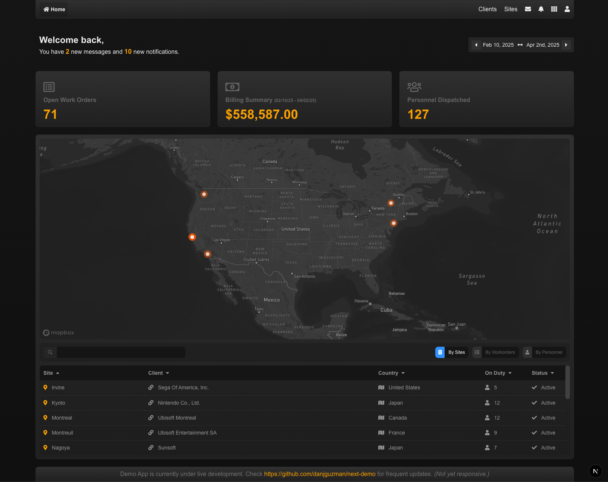

## About

This is a mock-up of a Workforce Management platform—though it’s flexible enough to work for any industry—built as a demo project with React and Next.js to showcase my front-end development skills. It focuses on crafting reusable components, managing data with a state manager like Redux Toolkit, and wrangling data from multiple sources—fetching, parsing, and blending it into clean, UI-ready states.

The project is fully open and you’re welcome to follow along as I turn ideas into solid, working software. It’s still actively in development, so you might notice a few issues here and there until I get them sorted out.

## What’s Inside

This demo includes some core features you’d typically find in platforms similar to this:

- A dynamically generated table with sorting, making it easy to organize and explore data.
- A Mapbox-powered map with custom markers to visualize locations, in 2D and 3D.
- Tiles that update with live data, showing real-time info in a clean, modular way.
- Redux Toolkit implementation for State Management.

## Developer Notes

- This is focused  on showcasing my code—live application demo coming soon.
- Demo coded by me, not AI.

*Note: If you pull this to run locally, Mapbox may not work properly since it requires a valid token to function, which I’ve omitted from my commits for obvious reasons (don't give out API keys to the world). Defaults to a blank section for Mapbox.*

  

  

 

  

